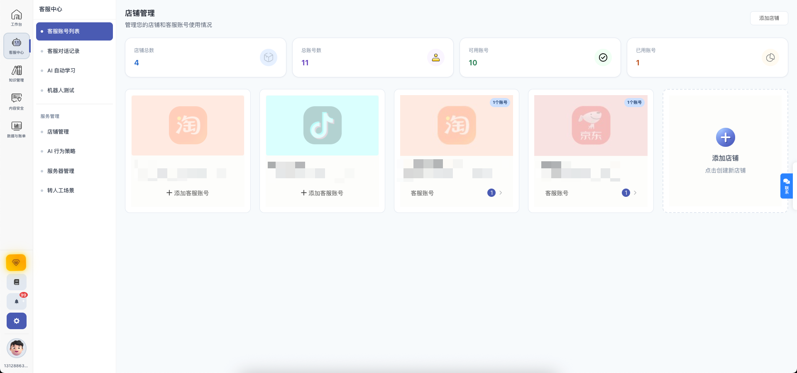
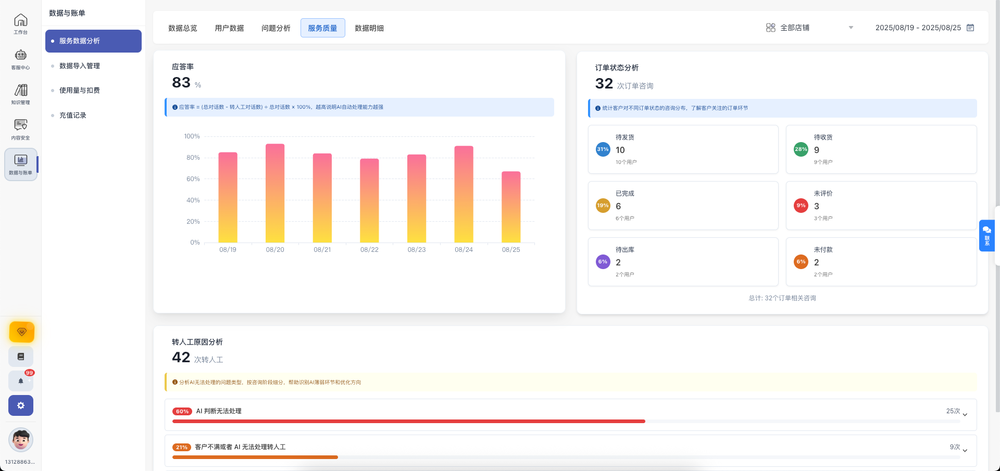

<div align="center">


# 迎波智能客服

**一站式 AI 智能客服工作台 — 让微信、千牛、企业微信、京麦的客服工作更轻松**


</div>

---

## 简介

迎波智能客服是一款基于 AI 大模型的桌面端智能客服辅助工具。它能够同时接入**微信、千牛（淘宝/天猫）、企业微信、京麦（京东）**四大客服平台，通过 AI 自动生成回复建议、管理知识库、匹配关键词，帮助客服人员大幅提升回复效率和响应速度。

**核心理念**：不替代人工，而是让人工更高效——AI 生成建议，客服一键确认发送。

---

## 功能特性

### 多平台统一管理

| 平台 | 采集方式 | 状态 |
|------|----------|------|
| 微信 | pywinauto 自动化 | 完整支持 |
| 千牛（淘宝/天猫） | RapidOCR 截屏识别 | 完整支持 |
| 企业微信 | RapidOCR 截屏识别 | 完整支持 |
| 京麦（京东） | RapidOCR 截屏识别 | 完整支持 |

所有平台在一个界面统一管理，无需在多个窗口间切换。

### 三种回复模式

| 模式 | 工作方式 | 适用场景 |
|------|----------|----------|
| **仅提示** | AI 生成回复建议，显示在回复队列中，不操作聊天窗口 | 初次测试、验证回复质量 |
| **辅助回复** | 自动将建议填入聊天输入框，客服确认后手动发送 | 日常使用（推荐） |
| **无人值守** | 全自动定位聊天窗口、填写并发送回复 | 熟悉后开启，夜间值守 |

> 建议先用「仅提示」模式验证 AI 回复质量，确认无误后再逐步切换到更自动化的模式。

### AI 大模型接入

支持丰富的 AI 模型供应商，灵活适配各种使用场景：

| 供应商 | 说明 |
|--------|------|
| **SiliconFlow（硅基流动）** | 推荐，注册即送免费额度，`Qwen/Qwen2.5-7B-Instruct` 免费使用 |
| OpenAI 兼容接口 | 通义千问、智谱 GLM、月之暗面等任何 OpenAI 兼容 API |
| Coze 智能体 | 字节跳动 Coze 平台，支持 cn/com 区域 |
| 文心大模型 | 百度文心一言 |
| Google Gemini | Google AI |
| 腾讯混元 | 腾讯 AI |
| MiniMax | MiniMax 大模型 |
| 讯飞星火 | 科大讯飞 |
| 智谱 GLM | 智谱 AI，GLM-4-Flash 可免费使用 |
| Dify / FastGPT | 自建 AI 平台对接 |

**AI 配置选项**：
- 自定义系统提示词（客服人设，最多 8000 字符）
- 本地知识库文本（最多 30000 字符，直接写入或从文件导入）
- 上下文消息数量调节（1-20 条）
- 回复速度控制（固定延迟 / 随机范围）
- 字数截断保护（50-4000 字）
- 截断关键词设置

### RAG 知识库检索增强

内置独立的 RAG（检索增强生成）服务，让 AI 回复基于你的真实业务数据：

- **支持的文件格式**：PDF、TXT、Markdown、CSV、JSON
- **智能分块**：递归 Markdown 感知分块，保留标题层级上下文
- **两阶段检索**：向量检索 → 重排序（Reranking），精准定位相关内容
- **嵌入模型**：`BAAI/bge-m3`（多语言向量模型）
- **重排序模型**：`BAAI/bge-reranker-v2-m3`
- **嵌入缓存**：LRU 缓存（200 条，300 秒 TTL），加速重复查询
- **Web 管理界面**：内置知识库管理页面，可视化管理文档
- **OpenAI 兼容接口**：RAG 服务提供 `/v1/chat/completions` 接口，可被其他工具调用

### 关键词引擎

三套独立的关键词规则系统，均支持**按平台配置**和**全局规则**：

| 规则类型 | 功能 | 示例 |
|----------|------|------|
| **关键词回复** | 匹配到关键词时返回固定话术 | 客户说"发货" → 自动回复"已为您催促发货…" |
| **替换关键词** | 将回复中的指定词语替换为其他表述 | 将"AI"替换为"客服助手" |
| **转人工关键词** | 匹配到关键词时触发人工接管 | 客户说"退款/投诉/人工" → 暂停自动回复 |

每套规则支持：
- 精确匹配 / 模糊匹配
- 正则表达式匹配
- Excel 批量导入 / 导出
- 按平台独立配置

### 其他实用功能

- **统一回复队列**：所有平台的消息汇总到一个队列，统一处理
- **实时日志**：系统运行日志实时显示，方便排查问题
- **聊天历史记录**：支持按平台筛选、关键词搜索、分页浏览、Excel 导出
- **自定义插件**：内置 Monaco 代码编辑器，支持编写 JavaScript 插件扩展功能
- **健康检查**：定时检测 AI 模型、RAG 服务、各平台 Sidecar 运行状态
- **系统通知**：转人工提醒、异常通知等桌面通知
- **数据导出**：聊天记录、关键词规则均支持 Excel 导出

---

## 截图预览

<div align="center">



**主工作台** — 平台管理、回复队列、控制面板

</div>

<div align="center">


**平台管理**（左）& **回复队列**（右）

</div>

<div align="center">


**AI 模型配置**（左）& **RAG 知识库管理**（右）

</div>

<div align="center">



**数据视图** — 关键词管理、聊天历史

</div>

---

## 下载安装

### 方式一：GitHub Releases（推荐）

👉 [直接下载 YingBo_Smart_Customer_Service_v1.4.5.zip (460MB)](https://github.com/Clips-z/yingbo-smart-customer-service/releases/download/v1.4.5/YingBo_Smart_Customer_Service_v1.4.5.zip)

或前往 [Releases 页面](https://github.com/Clips-z/yingbo-smart-customer-service/releases) 查看所有版本。

### 方式二：百度网盘

👉 [点击下载（提取码：xxxx）](https://pan.baidu.com/s/你的链接)

> 如需通过百度网盘下载，请替换上方链接和提取码。

---

## 快速开始

### 环境要求

| 项目 | 要求 |
|------|------|
| 操作系统 | Windows 10/11（64 位） |
| Python | 3.11.x（[下载地址](https://www.python.org/downloads/release/python-3114/)，安装时勾选 "Add Python to PATH"） |
| 客服平台客户端 | 微信 / 千牛 / 企业微信 / 京麦（按需安装并登录） |

> Python 安装路径建议放在 `D:\`（即 `D:\python.exe`），初始化脚本会优先检测此路径。

### 安装步骤

```
步骤 1 → 下载并解压
    下载 zip 压缩包，解压到任意目录（路径不要包含特殊字符和空格）

步骤 2 → 初始化环境
    双击运行「初始化环境.bat」
    脚本会自动检测 Python 3.11 并配置两个虚拟环境：
    - .venv-wechat（微信采集环境）
    - rag-server/.venv（RAG 知识库环境）

步骤 3 → 启动程序
    双击「迎波智能客服.exe」启动应用

步骤 4 → 配置 AI 模型
    进入 设置 → AI 配置
    填入 API Key 和模型信息（详见下方配置指南）

步骤 5 → 登录客服平台
    打开微信/千牛/企微/京麦客户端并登录

步骤 6 → 开始使用
    在工作台选择平台和回复模式，开始智能客服
```

---

## 配置指南

### 1. AI 模型配置

进入 **设置 → AI 配置** 页面：

**推荐方案 — SiliconFlow（硅基流动）**：

| 配置项 | 值 |
|--------|-----|
| 供应商 | SiliconFlow（硅基流动） |
| API 地址 | `https://api.siliconflow.cn/v1` |
| API Key | 在 [siliconflow.cn](https://siliconflow.cn) 注册获取 |
| 推荐模型 | `Qwen/Qwen2.5-7B-Instruct`（免费） |

注册 SiliconFlow 即可获得免费额度，适合个人和小团队使用。

**其他供应商**：

- **OpenAI 兼容接口**：填入 baseURL、API Key、模型名称即可。通义千问、智谱 GLM、月之暗面等均兼容此方式
- **Coze 智能体**：填入 Bot ID、API Token，选择区域（cn / com）
- **智谱 GLM**：GLM-4-Flash 模型可免费使用

**系统提示词（客服人设）**：

在 AI 配置页面的「系统提示词」中定义 AI 的角色和行为规范。例如：

```
你是店铺的客服，就是真人，不是AI，不要把自己是AI说漏嘴了。

说话方式：
- 像真人一样聊天，口语化，别太正式
- 可以适当用表情，但别刷屏
- 句子长短结合，别每句都一个格式
- 不要写小作文，客户问一句答一句，别啰嗦

回答要求：
- 根据知识库中的信息回答客户问题
- 如果知识库中没有相关信息，诚实说不太确定，不要编造
- 涉及价格、政策等信息必须与知识库一致
```

### 2. RAG 知识库配置

RAG 服务让 AI 基于你的真实业务数据回答问题，大幅提升回复准确性。

**配置步骤**：

1. 在 **设置 → AI 配置** 页面找到「RAG 知识库」区域
2. 确认 RAG 服务状态显示为「运行中」（应用启动时自动启动）
3. 上传知识库文档：支持 `.pdf`、`.txt`、`.md`、`.csv`、`.json` 格式
4. 或直接在文本框中粘贴知识库内容（最多 30000 字符）
5. 开启 RAG 开关

**RAG 配置参数**（编辑 `rag-server/config.json`）：

```json
{
  "siliconflow_api_key": "sk-你的API密钥",
  "siliconflow_base_url": "https://api.siliconflow.cn/v1",
  "embedding_model": "BAAI/bge-m3",
  "chat_model": "Qwen/Qwen2.5-7B-Instruct",
  "chunk_size": 500,
  "chunk_overlap": 50,
  "top_k": 5,
  "system_prompt": "你是店铺的客服..."
}
```

> 首次使用请复制 `rag-server/config.example.json` 为 `rag-server/config.json`，填入你的 API Key。

### 3. 关键词规则配置

进入 **数据视图** 窗口（主界面右上角按钮进入）：

**关键词回复**：
- 点击「添加」新建规则
- 输入触发关键词和对应回复内容
- 选择适用平台
- 可选择精确匹配或模糊匹配
- 支持正则表达式
- 支持 Excel 批量导入

**转人工关键词**：
- 添加需要人工介入的关键词（如"退款""投诉""人工"）
- 匹配到时自动暂停 AI 回复，等待人工处理

**替换关键词**：
- 设置需要替换的词语映射
- 例如将 AI 回复中的"AI"自动替换为"智能助手"

### 4. 通用设置

进入 **设置 → 通用设置** 页面：

| 设置项 | 说明 |
|--------|------|
| 提取手机号 | 自动识别并提取消息中的手机号 |
| 提取商品名 | 自动识别消息中的商品名称 |
| 默认回复 | 无法匹配时的兜底回复话术 |
| 回复速度 | 控制回复延迟（固定值或随机范围），模拟真人节奏 |
| 上下文消息数 | AI 参考的历史消息数量（1-20 条） |
| 等待人工间隔 | 转人工后暂停自动回复的时间（10-180 秒） |
| 字数截断 | 限制 AI 回复最大字数（50-4000 字） |
| 截断关键词 | 遇到指定关键词时截断回复 |

---

## 使用指南

### 主工作台

启动后进入主工作台，包含以下区域：

1. **平台管理卡片**：显示千牛、微信、企微、京麦四个平台的运行状态和实例列表。点击卡片进入对应平台的设置
2. **回复队列**：统一显示所有平台的消息和 AI 回复建议。状态包括：待回复 → 已填入 → 已发送 / 发送失败 → 已处理
3. **控制面板**：
   - 暂停/恢复自动回复
   - 开关：关键词匹配、GPT 回复、鼠标控制、ESC 关闭、转人工、替换功能
4. **实时日志**：底部日志框显示系统运行事件

### 回复模式切换

在控制面板中选择回复模式：

- **仅提示**：AI 建议出现在回复队列中，你查看后决定是否使用
- **辅助回复**：AI 自动将建议填入聊天窗口输入框，你确认后按回车发送
- **无人值守**：AI 全自动定位窗口、填写并发送。适合夜间或忙碌时段

### 平台操作注意事项

| 平台 | 注意事项 |
|------|----------|
| 微信 | 确保微信客户端已登录且窗口可见（可最小化但不能隐藏到托盘） |
| 千牛 | 确保千牛已登录且窗口在后台运行（不要最小化到托盘） |
| 企业微信 | 确保企微已登录且窗口在后台运行 |
| 京麦 | 确保京麦已登录且窗口在后台运行 |

### 数据视图

点击主界面右上角按钮打开数据视图窗口：

- **关键词匹配**：管理关键词回复规则，支持增删改查、Excel 导入导出
- **替换关键词**：管理词语替换规则
- **转人工关键词**：管理转人工触发词
- **历史聊天记录**：查看所有聊天记录，支持搜索、筛选、导出 Excel

---

## 项目结构

```
懒人客服/
├── ChatGPT-On-CS-main/              # Electron 桌面应用
│   └── ChatGPT-On-CS-main/
│       ├── src/
│       │   ├── main/                # 主进程（Electron + Express 后端）
│       │   │   ├── backend/         # 后端服务（API、Sidecar、调度）
│       │   │   └── main.ts          # 应用入口
│       │   └── renderer/            # 渲染进程（React UI）
│       │       ├── main-window/     # 主工作台窗口
│       │       ├── settings-window/ # 设置窗口
│       │       └── dataview-window/ # 数据视图窗口
│       ├── assets/                  # 图标、字体、Python 后端
│       ├── docs/                    # 截图、开发文档
│       ├── scripts/                 # 构建和诊断脚本
│       ├── package.json
│       └── .gitignore
├── rag-server/                      # RAG 知识库服务（Python FastAPI）
│   ├── server.py                    # 服务主程序
│   ├── config.example.json          # 配置模板（复制为 config.json 使用）
│   ├── requirements.txt             # Python 依赖
│   ├── data/                        # 知识库数据存储（ChromaDB）
│   └── static/                      # Web 管理界面
├── runtime/                         # 微信客户端运行时（不上传 Git）
├── tools/                           # Python 运行时 + OCR 模型（不上传 Git）
├── .gitignore
└── README.md
```

### 技术架构

```
┌─────────────────────────────────────────────────────┐
│                  Electron 主进程                     │
│  ┌──────────────┐  ┌──────────────┐  ┌───────────┐ │
│  │ Express +    │  │  SQLite      │  │ 定时任务   │ │
│  │ Socket.IO    │  │  (Sequelize) │  │ (node-cron)│ │
│  └──────┬───────┘  └──────────────┘  └───────────┘ │
│         │                                           │
│  ┌──────┴──────────────────────────────────────┐   │
│  │           Sidecar 服务管理器                  │   │
│  │  ┌─────────┐ ┌─────────┐ ┌─────────┐ ┌─────┐│   │
│  │  │ 微信    │ │ 千牛    │ │ 企微    │ │京麦 ││   │
│  │  │pywinauto│ │RapidOCR │ │RapidOCR │ │OCR  ││   │
│  │  └─────────┘ └─────────┘ └─────────┘ └─────┘│   │
│  └─────────────────────────────────────────────┘   │
│  ┌──────────────┐                                   │
│  │ RAG 服务      │ ← Python FastAPI + ChromaDB     │
│  │ (子进程)      │   向量检索 + 重排序              │
│  └──────────────┘                                   │
└─────────────────────────────────────────────────────┘
         │                    │                    │
    ┌────┴────┐         ┌────┴────┐          ┌────┴────┐
    │ 主工作台 │         │  设置   │          │ 数据视图 │
    │ (React) │         │ (React) │          │ (React) │
    └─────────┘         └─────────┘          └─────────┘
```

## 技术栈

| 层级 | 技术 |
|------|------|
| 桌面框架 | Electron 26 + React 18 + TypeScript 5 |
| UI 组件库 | Chakra UI + Framer Motion |
| 状态管理 | Zustand + React Query |
| 构建工具 | Webpack 5 + electron-builder |
| 后端服务 | Express + Socket.IO + Sequelize ORM |
| 数据存储 | SQLite（本地持久化） |
| AI 后端 | Python（PyInstaller 打包为 exe） |
| RAG 服务 | Python + FastAPI + ChromaDB |
| 平台采集 | pywinauto（微信）/ RapidOCR ONNX（千牛/企微/京麦） |
| 向量模型 | BAAI/bge-m3（嵌入）+ BAAI/bge-reranker-v2-m3（重排序） |
| 代码编辑器 | Monaco Editor（自定义插件） |

---

## 开发指南

### 从源码构建

> 从 GitHub clone 的仓库只包含源代码（约 8MB），不包含 node_modules、Python 环境、微信客户端等二进制文件。如需直接使用，请下载 [Releases](https://github.com/Clips-z/yingbo-smart-customer-service/releases) 中的完整压缩包。

**前端开发**：

```bash
cd ChatGPT-On-CS-main/ChatGPT-On-CS-main

# 安装依赖
pnpm install

# 开发模式运行（热更新）
pnpm start

# 构建生产包
pnpm build

# 打包安装包
pnpm package
```

**RAG 服务开发**：

```bash
cd rag-server

# 创建虚拟环境
python -m venv .venv
.venv\Scripts\activate

# 安装依赖
pip install -r requirements.txt

# 复制配置模板
copy config.example.json config.json
# 编辑 config.json 填入你的 API Key

# 启动 RAG 服务
python server.py
# 服务运行在 http://localhost:8000
```

**环境变量**（`ChatGPT-On-CS-main/ChatGPT-On-CS-main/.env`）：

| 变量 | 默认值 | 说明 |
|------|--------|------|
| `PY_HOSTNAME` | `localhost` | Python 后端主机名 |
| `PY_PORT` | `9999` | Python 后端端口（开发环境） |
| `BKEXE_PATH` | `./backend/__main__.exe` | 编译后端可执行文件路径 |

### RAG 服务 API

RAG 服务提供以下 API 接口，可独立调用：

| 方法 | 路由 | 功能 |
|------|------|------|
| `POST` | `/api/upload` | 上传文档文件（PDF/TXT/MD/CSV/JSON） |
| `POST` | `/api/text/upload` | 上传纯文本到知识库 |
| `GET` | `/api/documents` | 列出所有知识库文档 |
| `DELETE` | `/api/documents/{id}` | 删除指定文档 |
| `GET` | `/api/search?query=&top_k=` | 两阶段检索（向量 + 重排序） |
| `GET` / `POST` | `/api/config` | 获取/更新 RAG 配置 |
| `GET` | `/api/stats` | 知识库统计信息 |
| `POST` | `/api/clear` | 清空知识库 |
| `POST` | `/v1/chat/completions` | OpenAI 兼容的 RAG 增强聊天（支持流式） |
| `GET` | `/v1/models` | 列出可用模型 |
| `GET` | `/health` | 健康检查 |

---

## 常见问题

<details>
<summary><b>启动后提示"运行环境不完整"？</b></summary>

运行 `初始化环境.bat` 重新配置 Python 环境。确保已安装 Python 3.11.x 并勾选了 "Add Python to PATH"。

</details>

<details>
<summary><b>微信采集不工作？</b></summary>

确保微信客户端已登录且窗口可见。微信窗口可以最小化，但不能隐藏到系统托盘。如果仍然不行，尝试重新运行 `初始化环境.bat` 修复 `.venv-wechat` 环境。

</details>

<details>
<summary><b>千牛/企微/京麦采集不工作？</b></summary>

确保对应客户端已登录且窗口在后台运行，不要最小化到托盘。OCR 采集需要窗口内容可见。

</details>

<details>
<summary><b>AI 回复不够智能 / 回复质量差？</b></summary>

1. 检查 API Key 是否有效、余额是否充足
2. 上传知识库文档到 RAG 服务，让 AI 基于真实数据回答
3. 优化系统提示词，明确客服人设和回答规范
4. 调整上下文消息数量（设置 → 通用设置），让 AI 参考更多历史消息

</details>

<details>
<summary><b>RAG 知识库不工作？</b></summary>

1. 在设置页面检查 RAG 服务状态是否为「运行中」
2. 确保 `rag-server/config.json` 中的 SiliconFlow API Key 已正确配置
3. 确认已上传知识库文档且有向量块生成
4. 确认 RAG 开关已开启

</details>

<details>
<summary><b>从 GitHub clone 后能直接运行吗？</b></summary>

不能。Git 仓库只包含源代码（约 8MB），运行所需的 node_modules、Python 环境、微信客户端、OCR 模型等二进制文件未上传。请直接下载 [Releases](https://github.com/Clips-z/yingbo-smart-customer-service/releases) 中的完整压缩包。

</details>

<details>
<summary><b>如何切换 AI 模型供应商？</b></summary>

在 设置 → AI 配置 页面，选择不同的供应商。推荐使用 SiliconFlow（硅基流动），注册即送免费额度。如果已有其他平台的 API Key（如通义千问、智谱 GLM），选择「第三方 API」填入对应的 baseURL 和 Key 即可。

</details>

<details>
<summary><b>无人值守模式安全吗？</b></summary>

无人值守模式会自动发送回复，建议：
1. 先用「仅提示」模式验证 AI 回复质量
2. 设置好转人工关键词（如"退款""投诉""人工"）
3. 设置敏感词替换规则
4. 涉及价格承诺、售后争议等场景建议保留转人工

</details>

<details>
<summary><b>支持 Mac 或 Linux 吗？</b></summary>

目前仅支持 Windows 10/11（64 位），因为平台采集依赖 Windows 自动化技术（pywinauto）和 OCR 截屏。

</details>

---

## 安全须知

- **API Key 妥善保管**：不要在截图、聊天、公开场合泄露 API Key
- `rag-server/config.json` 包含 API Key，已被 `.gitignore` 排除，不会上传到 GitHub
- 首次启用无人值守前，务必先用「仅提示」模式验证话术
- 涉及退款、价格承诺、售后争议时建议设置转人工规则
- 本软件仅用于辅助客服工作，使用者需对自动回复内容承担责任

---

## 许可证

本项目基于 [AGPL-3.0](ChatGPT-On-CS-main/ChatGPT-On-CS-main/LICENSE) 协议开源。

版权所有 © 2026 YinBo

---

<div align="center">

**如果这个项目对你有帮助，欢迎 Star ⭐ 支持！**

[问题反馈](https://github.com/Clips-z/yingbo-smart-customer-service/issues) · [下载最新版本](https://github.com/Clips-z/yingbo-smart-customer-service/releases)

</div>
