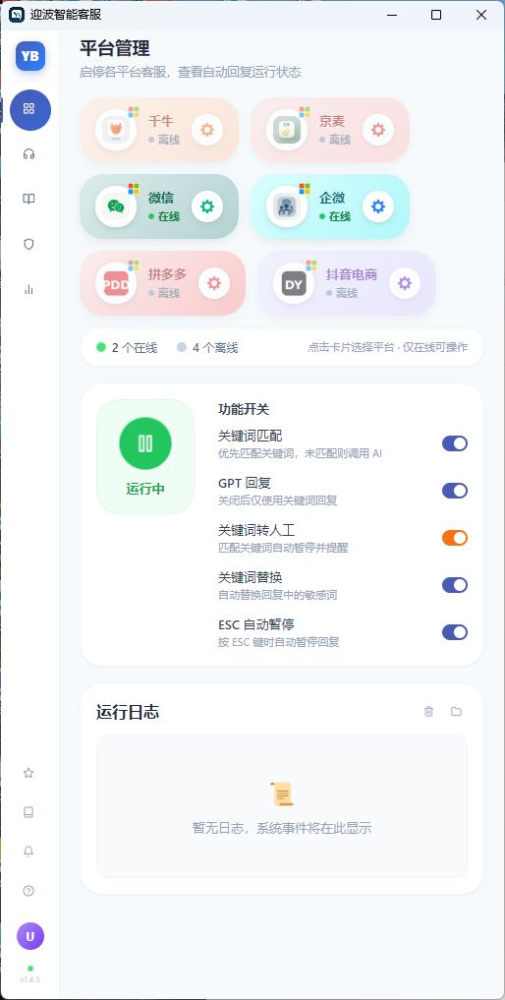

<div align="center">


# 迎波智能客服

**Windows 多平台 AI 客服工作台｜消息采集、辅助回复、RAG 知识库与运营管理**


[下载最新版](https://github.com/Clips-z/yingbo-smart-customer-service/releases) · [提交问题](https://github.com/Clips-z/yingbo-smart-customer-service/issues)

</div>

---

## 项目简介

迎波智能客服是一套面向个人客服、小团队与电商运营人员的 Windows 桌面工作台。它将微信、企业微信、千牛等客户端的消息采集、AI 回复建议、知识库管理和运行状态集中到一个界面中。

当前版本重点解决四件事：

- 客服客户端在后台或最小化时，仍能持续采集新消息。
- AI 建议统一进入回复工作台，由客服审核、编辑、填入或处理。
- 商品资料和店铺问答持久化保存，并同步到 RAG 向量知识库。
- 采集器、RAG 服务和发送流程都有健康状态、失败原因和自动重试。

> 本项目优先保证不误发、不串会话、不抢占用户桌面。平台能力不满足安全条件时，会自动降级为仅提示或辅助回复。

## 最新界面

<div align="center">



**主工作台：平台状态、功能开关与运行日志**

</div>

<div align="center">


**统一回复工作台**（左）与 **商品知识管理**（右）

</div>

## 已实现功能

### 1. 多平台消息采集

| 平台 | 当前能力 | 说明 |
|---|---|---|
| 微信 3.9 | 后台采集、辅助回复、经确认的后台无人值守发送 | 使用 UIA + 后台窗口消息；发送前校验联系人和输入内容 |
| 微信 4.x | OCR 后台采集、仅提示/辅助回复 | 自动识别客户端版本；不操作无效的微信辅助小窗 |
| 企业微信 | OCR 后台采集、最小化采集、仅提示/辅助回复 | 支持当前会话 `0 未读` 的预览变化和两字短消息；桌面版后台自动发送暂不开放 |
| 千牛 | OCR 采集、辅助回复与受控发送 | 包含采集策略、填入结果和健康状态保护 |
| 京麦 | OCR 采集与建议生成 | 已接入统一 Sidecar 生命周期，建议先在实际店铺验证 |
| 拼多多 / 抖音电商 | 平台检测与基础适配 | 保留在测试阶段，生产使用前需完成对应客户端验证 |

采集器具备：

- 平台独立启停，关闭开关后会真正停止对应子进程。
- 后台截图与 OCR，不读取被其他窗口遮挡的桌面像素。
- 消息指纹、联系人冷却、启动基线与重复消息拦截。
- 私聊和群聊 `@我` 过滤，降低群消息误回复风险。
- 心跳检测、异常退出重启、指数退避和清晰的恢复提示。

### 2. 三种回复模式

| 模式 | 行为 | 推荐用途 |
|---|---|---|
| 仅提示 | 生成建议并进入工作台，不操作客服客户端 | 初次接入、话术验收 |
| 辅助回复 | 生成建议，支持定位/填入，由客服确认发送 | 日常办公，推荐默认使用 |
| 无人值守 | 通过平台安全开关后自动发送 | 仅对已完成后台发送验证的平台开放 |

无人值守模式包含显式风险开关、紧急停止、发送前联系人验证、人工草稿保护、结果回执和失败状态记录。企业微信桌面客户端的 CEF 输入框无法可靠接收后台文字，为避免抢前台影响办公，当前版本不会把前台自动化伪装成后台发送。

### 3. 统一回复工作台

- 按全部、微信、企微、千牛等平台筛选建议。
- 待回复、已处理、发送失败等状态分栏。
- 查看客户原消息和 AI 建议，可编辑后再填入。
- 批量选择、批量处理、清理已处理记录。
- WebSocket 实时刷新，并以 3 秒轮询作为断线兜底。
- 采集状态、错误原因、恢复建议和下次重试时间可见。

### 4. RAG 知识库同步

- RAG 服务随应用按需启动，支持外部服务探测和自动恢复。
- 商品和店铺问答保存到本地 SQLite，不再只存在浏览器内存。
- 新增或编辑知识后自动同步到 RAG。
- 显示 `待同步 / 已同步 / 同步失败` 状态及失败原因。
- 同步失败可单条重试，不影响本地知识继续维护。
- 支持 PDF、TXT、Markdown、CSV、JSON 文档和纯文本上传。
- 使用向量检索 + Reranking，为 AI 回复提供业务上下文。

### 5. 商品与店铺知识运营

- 商品名称、平台商品 ID、条码、店铺、标签和上下架状态管理。
- 店铺问答、相似问法、售前/售中/售后阶段、精确/模糊匹配管理。
- 搜索、筛选、分页、批量上下架和批量删除。
- CSV / XLSX 批量导入，导入前预览有效行和错误行。
- 单次最多处理 2000 行，错误定位到原文件行号。
- 输入长度、必填字段、枚举值和重复数据校验。

### 6. AI 与关键词能力

- 支持 OpenAI 兼容接口、SiliconFlow、通义千问、智谱、Coze、Dify、FastGPT 等配置方式。
- 自定义客服人设、上下文数量、回复长度和回复延迟。
- 关键词固定回复、回复词语替换和转人工关键词。
- 聊天记录搜索、平台筛选和数据导出。

## 快速开始

### 直接运行

1. 从 [Releases](https://github.com/Clips-z/yingbo-smart-customer-service/releases) 下载最新版运行包。
2. 解压到固定目录，避免直接在压缩包内部运行。
3. 打开并登录需要接入的微信、企业微信或电商客服客户端。
4. 运行 `迎波智能客服.exe`。
5. 配置 AI 接口与知识库，先使用“仅提示”完成话术验证。
6. 在平台设置中打开对应平台开关，并在回复工作台观察采集健康状态。

运行数据、日志、SQLite 数据库和知识库索引均保存在本地运行目录，不会提交到 Git 仓库。

### 推荐测试顺序

1. 使用两个测试账号互发唯一文本，例如 `企微入站测试2335`。
2. 确认工作台出现正确的平台、联系人、客户原消息和建议回复。
3. 最小化客服客户端后再次测试后台采集。
4. 辅助模式下检查定位和填入目标是否正确。
5. 只有在多轮测试无串会话、无误识别后，才考虑开启已支持平台的无人值守模式。

## 从源码开发

### 环境

- Windows 10/11 x64
- Node.js 18+
- pnpm
- Python 3.11

### Electron 应用

```powershell
cd ChatGPT-On-CS-main/ChatGPT-On-CS-main
pnpm install
pnpm test -- --runInBand
pnpm build
```

### 本地 Sidecar 环境

在 Electron 项目目录创建 `.venv-wechat`，安装 `scripts/requirements-wechat.txt` 中的依赖。RAG 环境位于仓库根目录 `rag-server/.venv`。这两个虚拟环境都被 `.gitignore` 排除，不要提交。

### 打包

```powershell
cd ChatGPT-On-CS-main/ChatGPT-On-CS-main
pnpm package
```

打包前需要存在：

- `ChatGPT-On-CS-main/ChatGPT-On-CS-main/.venv-wechat`
- `rag-server/.venv`

构建产物位于 `release/build`。运行时会把 `assets`、`scripts`、RAG 服务和两个 Python 环境放入 Electron `resources` 目录。

## 项目结构

```text
yingbo-smart-customer-service/
├─ ChatGPT-On-CS-main/ChatGPT-On-CS-main/
│  ├─ src/main/backend/       # Express、SQLite、Sidecar/RAG 生命周期
│  ├─ src/renderer/           # React 工作台与知识运营界面
│  ├─ scripts/                # 微信、企微、千牛等采集器
│  ├─ assets/                 # 图标与应用资源
│  └─ docs/                   # README 界面截图
├─ rag-server/                # FastAPI + ChromaDB RAG 服务
├─ docs/plans/                # 设计与实现记录
└─ README.md
```

## 测试与质量保护

当前测试覆盖知识持久化与导入、RAG 同步校验、消息去重、发送安全策略、采集健康状态、运行时路径和千牛辅助流程。提交前建议运行：

```powershell
pnpm test -- --runInBand
pnpm build
python -m py_compile scripts/wechat-sidecar.py scripts/wecom-sidecar.py
```

## 安全与隐私

- API Key、`.env`、`rag-server/config.json`、运行数据库、聊天日志和虚拟环境已排除在版本控制之外。
- 不要将真实客户聊天、手机号、订单号或密钥放进 README 截图。
- 自动发送前先验证转人工规则、敏感话术和兜底回复。
- 本项目用于辅助客服；使用者应对最终发送内容和平台合规负责。

安全问题请参阅 [SECURITY.md](SECURITY.md)。

## 许可证

本项目基于 [AGPL-3.0](ChatGPT-On-CS-main/ChatGPT-On-CS-main/LICENSE) 开源。

---

<div align="center">

如果这个项目对你有帮助，欢迎 Star ⭐

[Releases](https://github.com/Clips-z/yingbo-smart-customer-service/releases) · [Issues](https://github.com/Clips-z/yingbo-smart-customer-service/issues)

</div>
