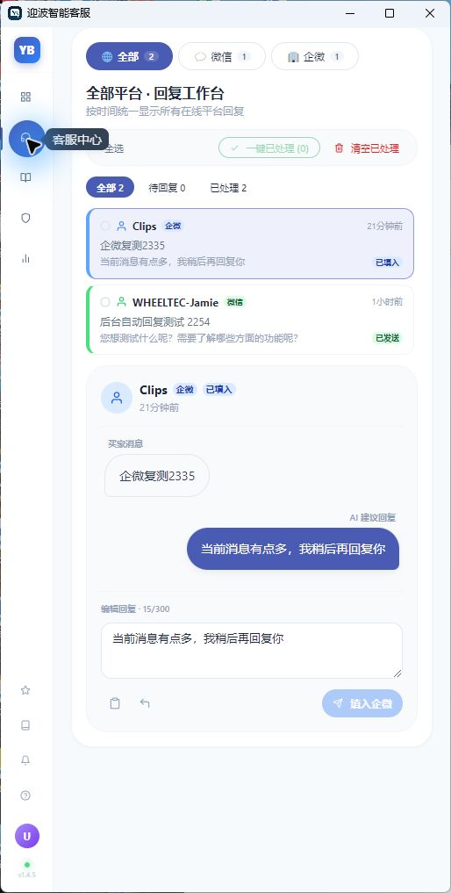
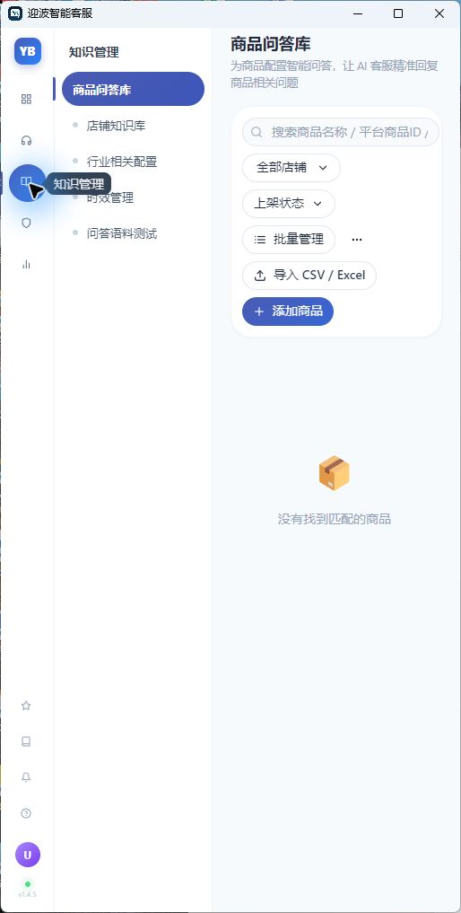
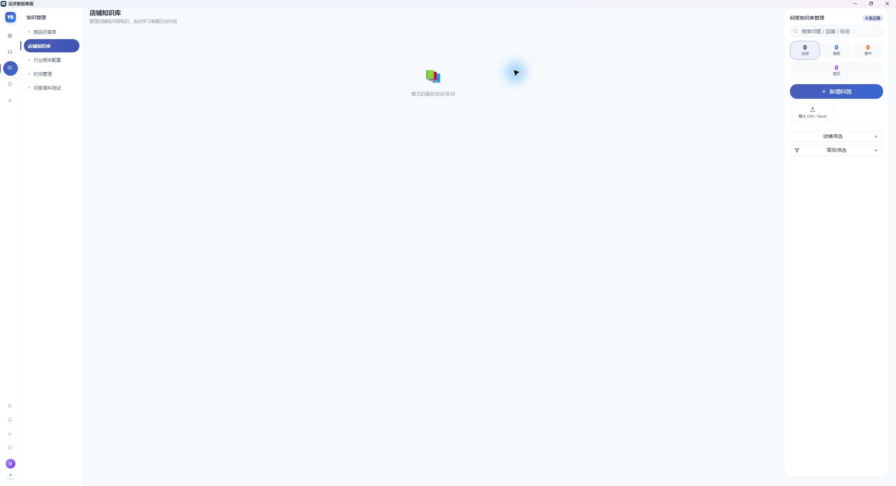
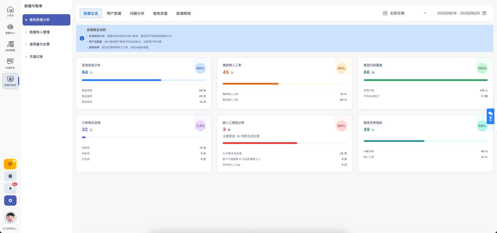

# 迎波智能客服

<p align="center">
  
</p>

<p align="center">
  
  
  
  
</p>

统一管理微信、千牛、企业微信、京麦等客服工作台，基于 AI 自动生成回复建议，支持 RAG 知识库、关键词匹配、转人工等智能客服功能。

---

## 功能特性

- **多平台支持**：微信、千牛（淘宝/天猫）、企业微信、京麦（京东）同时接入
- **三种回复模式**：仅提示 / 辅助回复 / 无人值守全自动
- **AI 大模型接入**：OpenAI 兼容接口（通义千问、SiliconFlow 等）、Coze 智能体
- **RAG 知识库**：上传产品文档、FAQ，让 AI 回复更精准
- **关键词引擎**：固定话术匹配、关键词转人工、敏感词替换
- **开箱即用**：下载即运行，无需编译

## 截图预览

<p align="center">
  
  
</p>
<p align="center">
  
  
</p>

---

## 下载

### 方式一：GitHub Releases（推荐）

👉 [直接下载 YingBo_Smart_Customer_Service_v1.4.5.zip (460MB)](https://github.com/Clips-z/yingbo-smart-customer-service/releases/download/v1.4.5/YingBo_Smart_Customer_Service_v1.4.5.zip)

或前往 [Releases 页面](https://github.com/Clips-z/yingbo-smart-customer-service/releases) 查看所有版本。

### 方式二：百度网盘

👉 [点击下载（提取码：xxxx）](https://pan.baidu.com/s/你的链接)

> 如需通过百度网盘下载，请替换上方链接和提取码。

---

## 快速开始

### 环境要求

- **系统**：Windows 10/11（64 位）
- **Python**：3.11.x（[下载地址](https://www.python.org/downloads/release/python-3114/)，安装时勾选 "Add Python to PATH"）
- **客服平台客户端**：微信 / 千牛 / 企业微信 / 京麦（按需安装）

### 使用步骤

1. **下载并解压**压缩包到任意目录（路径不含特殊字符）

2. **运行初始化**：双击 `初始化环境.bat`，脚本会自动检测 Python 并配置虚拟环境

3. **启动程序**：双击 `迎波智能客服.exe`

4. **配置 AI 模型**：进入 设置 → AI 配置
   - 供应商推荐：[SiliconFlow（硅基流动）](https://siliconflow.cn)，注册即送免费额度
   - API 地址：`https://api.siliconflow.cn/v1`
   - 模型推荐：`Qwen/Qwen2.5-7B-Instruct`（免费）

5. **打开客服平台**并登录（微信/千牛/企微/京麦）

6. **开始使用**：在工作台选择平台和回复模式

### 回复模式说明

| 模式 | 说明 | 适用场景 |
|------|------|----------|
| 仅提示 | 只生成回复建议，不操作聊天窗口 | 初次测试、纯参考 |
| 辅助回复 | 自动填入输入框，需人工确认发送 | 日常使用 |
| 无人值守 | 全自动定位、填写并发送 | 熟悉后开启，建议先测试 |

> 建议先用「仅提示」模式验证回复质量，再逐步切换到更自动化的模式。

---

## 项目结构

```
懒人客服/
├── ChatGPT-On-CS-main/          # Electron 桌面应用
│   └── ChatGPT-On-CS-main/
│       ├── src/                 # TypeScript 源码 (main + renderer)
│       ├── assets/              # 图标、字体、Python 后端
│       ├── docs/                # 截图、开发文档
│       ├── scripts/             # 构建脚本
│       ├── package.json
│       └── .gitignore
├── rag-server/                  # RAG 知识库服务 (Python)
│   ├── server.py                # 服务主程序
│   ├── config.example.json      # 配置模板（复制为 config.json 使用）
│   ├── requirements.txt
│   └── data/                    # 知识库数据存储
├── runtime/                     # 微信客户端运行时（不上传 Git）
├── tools/                       # Python 运行时 + OCR 模型（不上传 Git）
├── .gitignore
└── README.md
```

## 技术栈

| 层 | 技术 |
|----|------|
| 桌面框架 | Electron + React + TypeScript |
| 构建工具 | Webpack + electron-builder |
| AI 后端 | Python (PyInstaller 打包) |
| RAG 服务 | Python + FastAPI + 向量检索 |
| 平台采集 | pywinauto / RapidOCR (ONNX) |
| 数据存储 | SQLite |

## 开发指南

如需从源码构建，请参考源码目录中的开发文档：

```bash
# 安装依赖
cd ChatGPT-On-CS-main/ChatGPT-On-CS-main
pnpm install

# 开发模式运行
pnpm start

# 构建安装包
pnpm build
```

RAG 服务开发：

```bash
cd rag-server
python -m venv .venv
.venv\Scripts\activate
pip install -r requirements.txt
# 复制 config.example.json 为 config.json 并填入 API Key
python server.py
```

## 平台支持

| 平台 | 状态 | 采集方式 |
|------|------|----------|
| 微信 | 完整支持 | pywinauto |
| 千牛（淘宝/天猫） | 完整支持 | OCR 截屏 |
| 企业微信 | 完整支持 | OCR 截屏 |
| 京麦（京东） | 完整支持 | OCR 截屏 |

## 常见问题

<details>
<summary>点击展开</summary>

**Q: 启动后提示"运行环境不完整"？**
A: 运行 `初始化环境.bat` 重新配置 Python 环境。

**Q: 微信采集不工作？**
A: 确保微信客户端已登录且窗口可见（可以最小化但不能隐藏到托盘）。

**Q: 千牛/企微/京麦采集不工作？**
A: 确保对应客户端已登录且窗口在后台运行（不要最小化到托盘）。

**Q: AI 回复不够智能？**
A: 检查 API Key 是否有效，建议上传知识库文档到 RAG 服务提升回复质量。

**Q: RAG 知识库不工作？**
A: 在设置页面检查 RAG 服务状态，确保 SiliconFlow API Key 已配置。

**Q: 从 GitHub clone 后能直接运行吗？**
A: 不能。Git 仓库只包含源代码（约 8MB），运行所需的 node_modules、Python 环境、微信客户端、OCR 模型等二进制文件未上传。请直接下载 [Releases](../../releases) 中的完整压缩包。

</details>

## 安全须知

- API Key 请妥善保管，不要在截图、聊天中泄露
- 首次启用无人值守前，先用「仅提示」模式验证话术
- 涉及退款、价格承诺、售后争议时建议设置转人工规则

## 许可证

本项目基于 [AGPL-3.0](ChatGPT-On-CS-main/ChatGPT-On-CS-main/LICENSE) 协议开源。

版权所有 © 2026 YinBo
